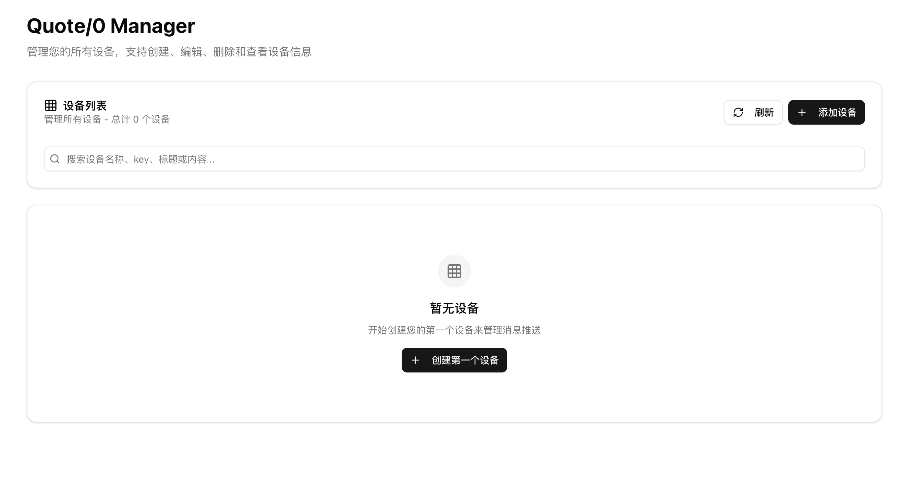
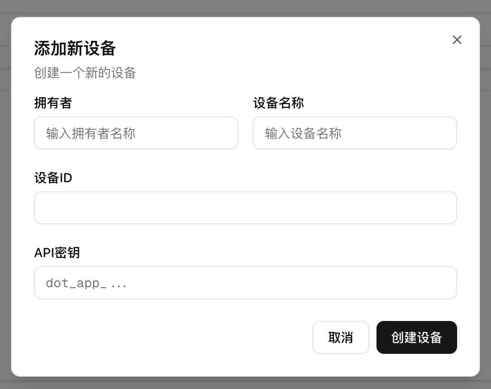

# Quote/0 发信 demo

> 本项目用于演示使用 Quote/0 的[文本 API](https://dot.mindreset.tech/docs/server/text_api)发信。
> （代码都是 AI 写的，比较糙 😆）

## 启动方法

1. 配置环境变量

```bash
cp .env.example .env
```

在 cloudflare 上创建一个 KV 存储，并配置环境变量

```
CLOUDFLARE_API_TOKEN=< cloudflare api token >
CLOUDFLARE_ACCOUNT_ID=< cloudflare 账号 id >
CLOUDFLARE_KV_NAMESPACE_ID=< cloudflare kv 存储 namespace id >
```

2. 安装依赖

```bash
pnpm install
```

3. 运行项目

```bash
pnpm dev
```

4. 访问 http://localhost:3000/dot 查看页面



## 配置说明



- 设备 ID 是 Quote/0 设备的序列号/MAC 地址，在 Dot. App 上可以查看
- API 密钥是用户的 API 密钥，在 Quote/0 的 “更多” Tab 中可以查看
